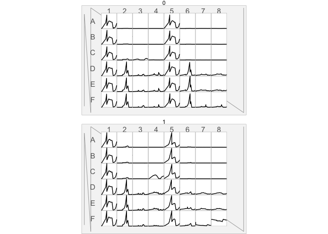
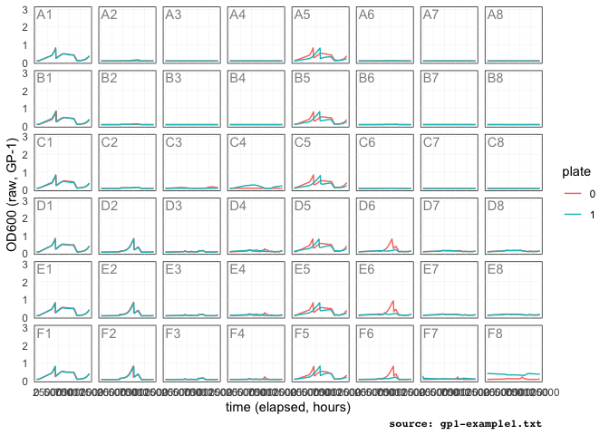

<!-- README.md is generated from README.Rmd. Please edit that file -->

<!-- badges: start -->

[](https://www.tidyverse.org/lifecycle/#maturing)
[](https://cran.r-project.org/package=readgp1)
<!-- badges: end -->

Read, ~~Validate~~, ~~Simulate~~ and ~~Write~~ GP1 instrument
files

## Installation

<!-- You can install the released version of gp1 from [CRAN](https://CRAN.R-project.org) with: -->

``` r
# install.packages("readgp1") # not yet
remotes::install_github("npjc/readgp1")
```

## Example

Read the raw data into tidy tibble:

``` r
library(readgp1)
path <- gp1_example("gp1-example1.txt")
read_gp1(path)
#> # A tibble: 10,128 x 4
#>    plate well  runtime measure
#>    <chr> <chr>   <int>   <dbl>
#>  1 0     A1          0   0.089
#>  2 0     A1        767   0.09 
#>  3 0     A1       1555   0.091
#>  4 0     A1       2343   0.091
#>  5 0     A1       3131   0.092
#>  6 0     A1       3919   0.093
#>  7 0     A1       4707   0.094
#>  8 0     A1       5496   0.094
#>  9 0     A1      34661   0.398
#> 10 0     A1      35449   0.423
#> # … with 10,118 more rows
read_gp1(path, all_fields = TRUE)
#> # A tibble: 10,128 x 6
#>    plate well  datetime            runtime measure_type measure
#>    <chr> <chr> <dttm>                <int> <chr>          <dbl>
#>  1 0     A1    2019-02-27 14:27:01       0 Epoch (GP-1)   0.089
#>  2 0     A1    2019-02-27 14:39:48     767 Epoch (GP-1)   0.09 
#>  3 0     A1    2019-02-27 14:52:56    1555 Epoch (GP-1)   0.091
#>  4 0     A1    2019-02-27 15:06:04    2343 Epoch (GP-1)   0.091
#>  5 0     A1    2019-02-27 15:19:12    3131 Epoch (GP-1)   0.092
#>  6 0     A1    2019-02-27 15:32:20    3919 Epoch (GP-1)   0.093
#>  7 0     A1    2019-02-27 15:45:28    4707 Epoch (GP-1)   0.094
#>  8 0     A1    2019-02-27 15:58:37    5496 Epoch (GP-1)   0.094
#>  9 0     A1    2019-02-28 00:04:42   34661 Epoch (GP-1)   0.398
#> 10 0     A1    2019-02-28 00:17:50   35449 Epoch (GP-1)   0.423
#> # … with 10,118 more rows
```

-----

To visualize the parsed output with the `mtpview` pkg:

``` r
library(mtpview1)
library(ggplot2)
d <- read_gp1(path)

mtp_ggplot(d, aes(plate = plate, well = well)) + 
  mtp_spec_48well() + 
  geom_footprint() + 
  geom_notched_border() + 
  geom_row_label() + 
  geom_col_label()  +
  geom_well_rect(fill = 'white') + 
  geom_well_line(aes(x = runtime, y = measure)) + 
  facet_wrap(~plate, ncol = 1)
```



Or with vanilla `ggplot2`

``` r
library(tidyverse)
d %>%
    group_by(plate, well) %>%
    ggplot(aes(x = runtime, y = measure)) +
    geom_line(aes(color = plate, group = interaction(plate, well))) +
    geom_text(aes(x = 0, y = 3, label = well, group = well), alpha = 0.5,
              hjust = 'left', vjust = 'top', data = distinct(d, well)) +
    facet_wrap(~well, ncol = 8) +
    labs(x = 'time (elapsed, hours)', y = 'OD600 (raw, GP-1)',
         caption = paste0('source: ', basename(path))) +
    theme_minimal() +
    theme(panel.grid.minor = element_blank(),
          panel.grid.major = element_line(size = 0.1),
          strip.background = element_blank(),
          strip.text = element_blank(),
          panel.background = element_rect(fill = NULL, color = 'black'),
          plot.caption = element_text(family = 'mono', face = 'bold'))
```


